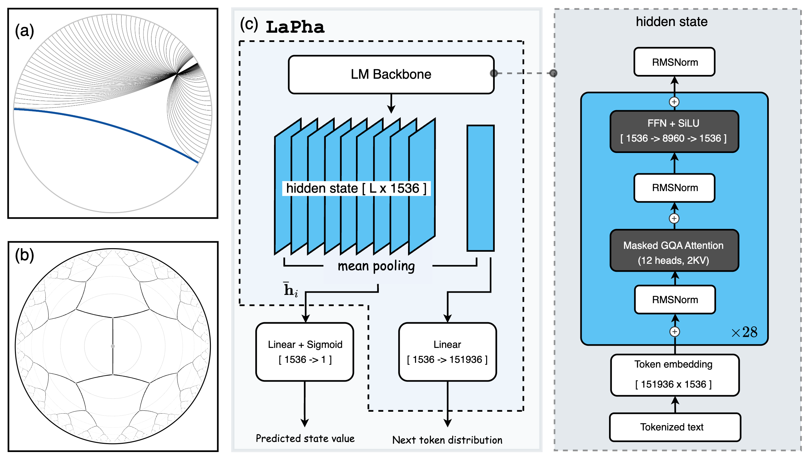
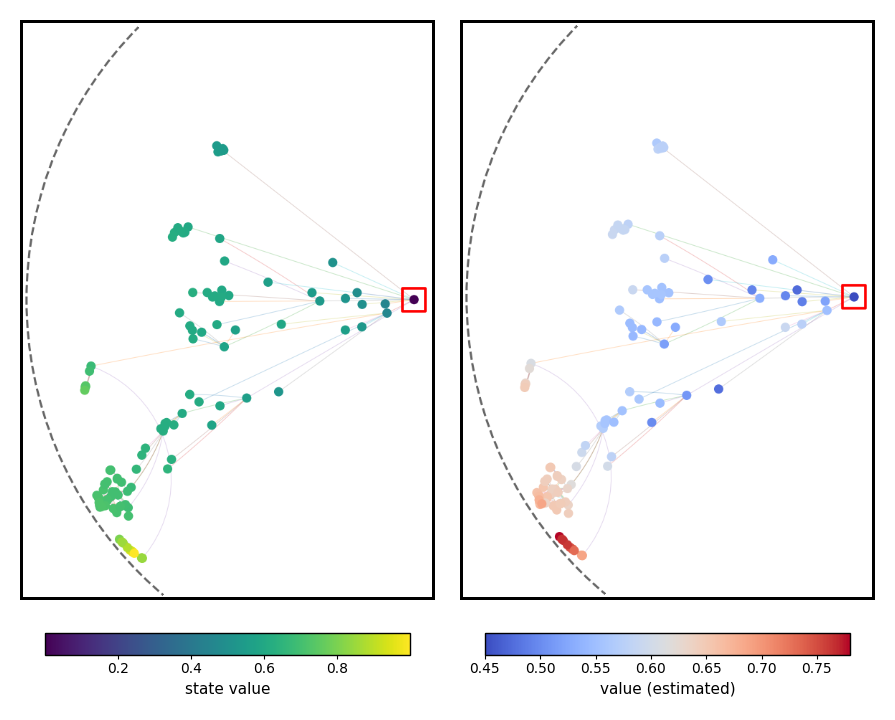
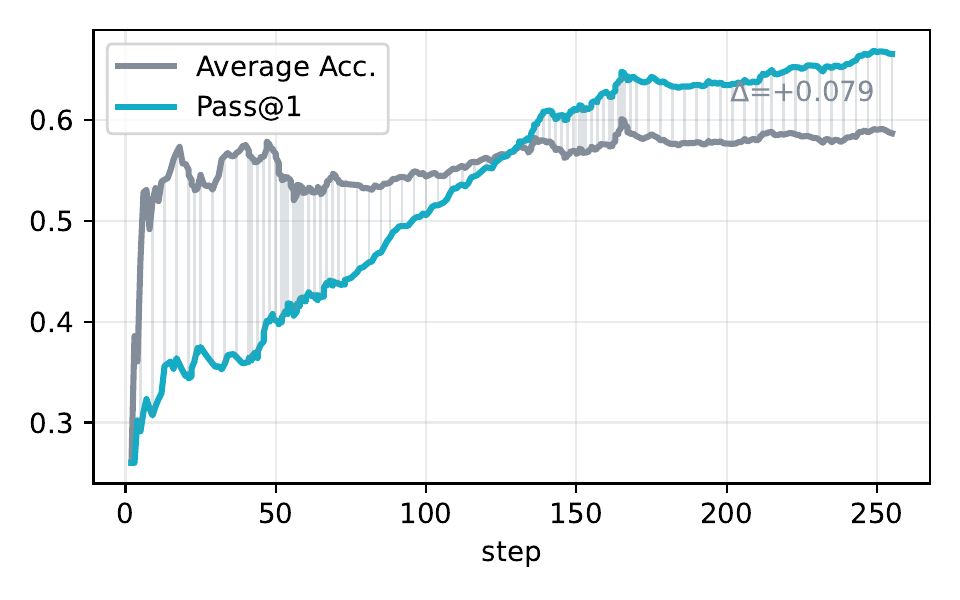

# LaPha: Latent Poincaré Shaping for Agentic Reinforcement Learning

This repository contains the reference implementation of **LaPha**, a method for training **AlphaZero-like LLM agents**
in a **prompt-centered Poincaré latent space**, enabling dense process reward shaping and lightweight value-guided
test-time scaling.

> Paper: *Latent Poincaré Shaping for Agentic Reinforcement Learning* (https://arxiv.org/pdf/2602.09375)

<p align="center">
  
</p>

---

## What is LaPha?

LaPha maps each **agent state** (a prompt + tool feedback + partial reasoning trace) into a **root-centered Poincaré ball**
and uses **hyperbolic geometry** to define a *potential function* that provides **dense process rewards** during RL.

Core ideas (matching the paper + current codebase):

- **Prompt-centered hyperbolic latent state**
  - Mean-pool the LM backbone hidden states into a state embedding.
  - Root-center w.r.t. the prompt (root state), and map into the Poincaré ball via an exponential map.
- **Potential-based dense shaping (process reward)**
  - Let \(y_i\) be the latent for node \(i\), and \(\mathcal{Y}^+\) be verified-correct terminal leaves.
  - Define distances:
    - \(d_i^{\text{goal}} = \min_{y_\omega \in \mathcal{Y}^+} d_\mathbb{D}(y_i, y_\omega)\)
    - \(d_i^{\text{root}} = d_\mathbb{D}(y_i, 0)\)
  - Potential:
    \[
      V(i) = \frac{d_i^{\text{root}}}{d_i^{\text{root}} + d_i^{\text{goal}}} \in [0, 1]
    \]
  - Process reward on edge \((i \to j)\):
    \[
      r(i,j) = V(j) - V(i)
    \]
- **Lightweight value head on the same shared latent**
  - A linear value head predicts \( \hat{V}(s) \) with sigmoid and is trained with MSE to match the geometry-derived potential.
  - At test time, the value head guides MCTS with **almost no extra overhead**.
- **Latent-space pruning**
  - Periodically cluster visited nodes in latent space and prune redundant paraphrastic branches, improving exploration efficiency.

---

## Key visualizations

### Value head aligns with geometry-derived potential (Figure 2)

<p align="center">
  
</p>

### During training, value-head top-1 selection improves beyond average leaf correctness (Figure 2)

<p align="center">
  
</p>

---

## Repository layout

- `trainer/`
  - `agent.py`: MCTS agent, latent distance shaping, pruning / clustering logic
  - `mtpo_trainer.py`: LaPha trainer (GRPO-style optimization + MCTS rollouts)
  - `mtpo_config.py`: training + MCTS hyperparameters (depth/breadth/num_sim/prune_per, distance shaping, etc.)
  - `latent_bank.py`: append-only latent store (GPU/CPU mirroring)
  - `vllm_client.py`: vLLM HTTP client for fast generation during training/eval
- `tools/`
  - `rpc_python_server.py`: FastAPI service used by the `execute_python_code` tool
  - `remote_python_code_interpreter.py`: tool wrapper calling the RPC server
- `eval/`
  - `rollout_jsonl.py`: roll out predictions on JSONL datasets (react/value/single modes)
  - `rewards.py`: rule-based graders + optional LLM-as-judge fallback
- `data/`: evaluation JSONLs (AIME’24/25, MATH-500, etc.)
- `run_dapo.py`, `run_dapo.sh`, `lapha.yaml`: training entry points/config
- `eval.sh`, `eval_math.py`: evaluation scripts (rollout + scoring)

---

## Installation

### Option A (recommended): create a Conda env from the exported lockfile

> The provided `requirements.txt` is a **conda explicit environment file** (see its header).

```bash
conda create -n lapha --file requirements.txt
conda activate lapha
````

### Option B: minimal pip install (if you prefer a clean env)

```bash
conda create -n lapha python=3.11 -y
conda activate lapha

pip install -U torch transformers accelerate deepspeed trl vllm \
  datasets pandas numpy rich matplotlib plotly \
  fastapi uvicorn gunicorn pdf2image pymupdf
```

> Notes:
>
> * vLLM requires a CUDA GPU setup.
> * If you use `attn_implementation: flash_attention_2`, you may need `flash-attn` matching your CUDA/PyTorch.

---

## Quickstart: evaluation on provided JSONL benchmarks

### 0) Start the Python tool server (for `execute_python_code`)

> **Security note:** this server executes Python. Bind to localhost or trusted network only.

```bash
gunicorn tools.rpc_python_server:app \
  --workers 4 \
  --worker-class uvicorn.workers.UvicornWorker \
  --bind 0.0.0.0:8001 \
  --max-requests 1000
```

### 1) Start a vLLM server for your policy model

Example (edit model & TP according to your GPUs):

```bash
trl vllm-serve \
  --model Qwen/Qwen2.5-Math-1.5B \
  --host 0.0.0.0 \
  --port 8000 \
  --tensor-parallel-size 1 \
  --max-model-len 4096
```

### 2) Run eval

**Single-turn (no search):**

```bash
ENGINE=vllm BASE_URL=http://localhost:8000 \
TOKENIZER_PATH=Qwen/Qwen2.5-Math-1.5B \
MODE=single \
bash eval.sh math
```

**Value-guided MCTS (recommended):**
You need a value head checkpoint (`.pt`) and a base LM path for the value function.

```bash
ENGINE=vllm BASE_URL=http://localhost:8000 \
TOKENIZER_PATH=/path/to/policy_model \
MODE=value \
VALUE_BASE=/path/to/policy_model \
VALUE_HEAD=/path/to/value_head.pt \
REACT_DEPTH=6 REACT_BREADTH=6 \
MCTS_NUM_SIM=128 \
bash eval.sh aime24
```

Outputs:

* rollouts: `eval/rollouts/*.pred.jsonl`
* scores: `eval/results/*.csv` (and logs under `eval/logs/`)

---

## Training (LaPha RL)

The training entry point is `run_dapo.py` (configured by `lapha.yaml`).

### 1) Prepare training data

The current dataloader (`helpers/math_dapo.py::dataloader`) expects a **Parquet** in a DAPO-like format
(e.g., columns `prompt` and `reward_model` containing ground-truth).

Update the dataset path inside `run_dapo.py`:

```python
train_dataset = dataloader_dapo('YOUR_DATA_PATH/train.parquet').shuffle()
```

### 2) Start vLLM + tool server

* Start vLLM server (same as eval)
* Start `rpc_python_server.py` (same as eval)

### 3) Launch training

```bash
bash run_dapo.sh
# or:
accelerate launch --config_file deepspeed_zero3.yaml run_dapo.py --config lapha.yaml
```

Checkpoints are saved under `output_dir` in `lapha.yaml`.

### 4) (Optional) Split value head for serving

If your checkpoint directory contains a wrapper model that includes both policy + value head, use:

```bash
python helpers/split_valuehead.py \
  --src /path/to/checkpoint-XX \
  --out-policy /path/to/policy_model_ckptXX \
  --out-vhead /path/to/value_head_ckptXX.pt \
  --copy-tokenizer \
  --trust-remote-code
```
